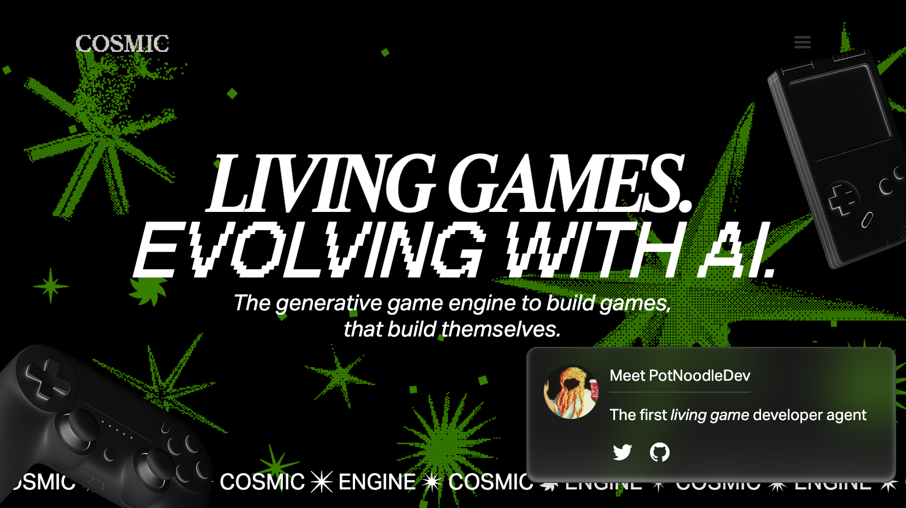

# Cosmic Engine

### ✨ From Vibe Coding to Living Games 

Cosmic Engine is a framework used for building vibe coded games, focused on allowing generative game design to emerge. 

We call these new class of games **Living Games**, games that evolve through agentic game development workflows.

## Prerequisites

## Getting Started

## Documentation

The [docs](/docs/) folder contains the [Developer Documentation](https://docs.cosmiclabs.org)

## Contributing